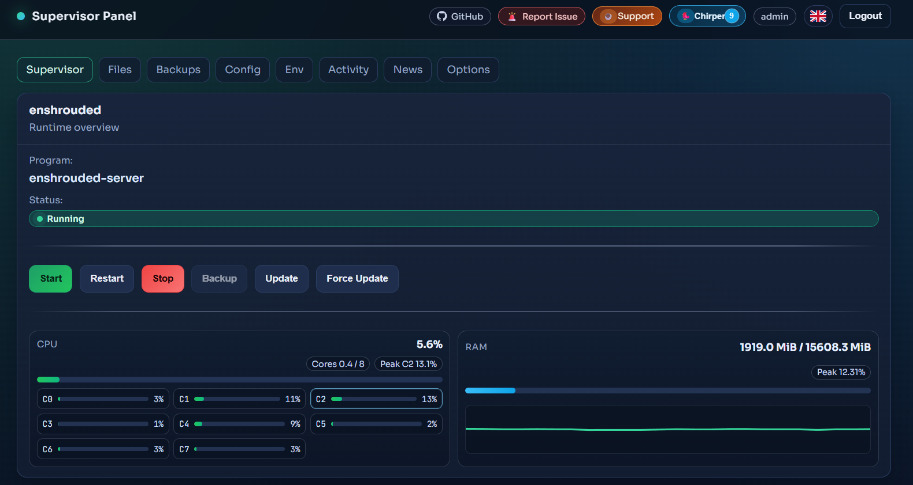
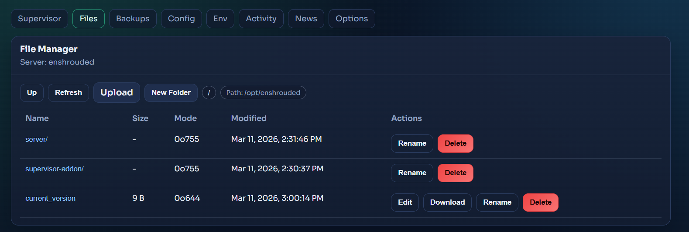
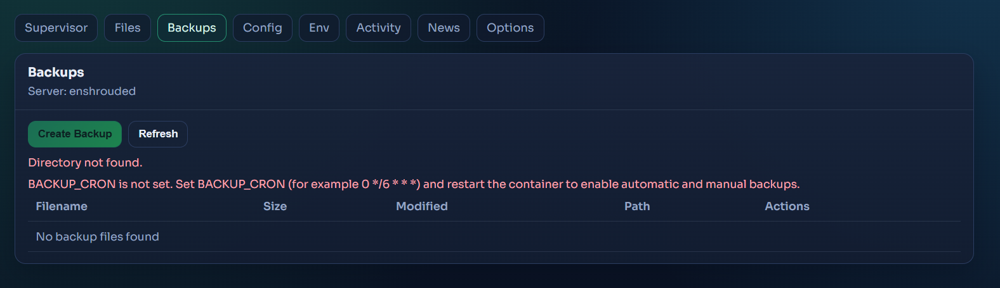
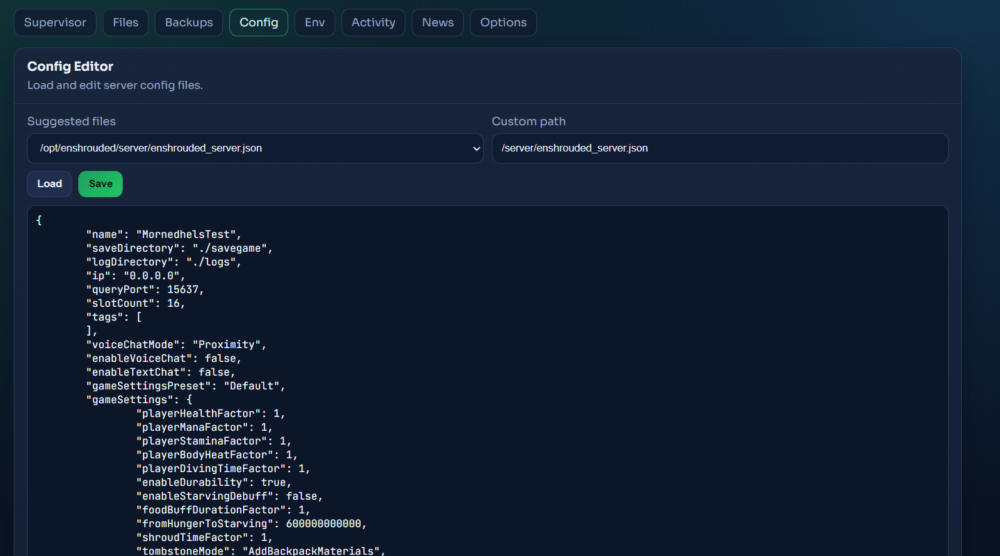
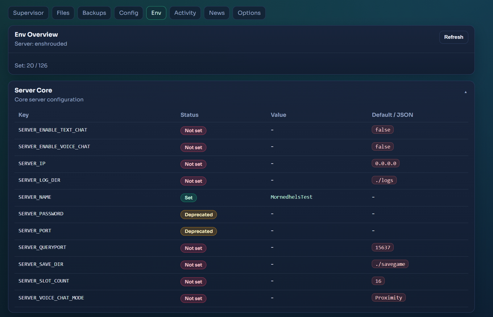
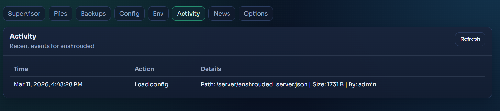
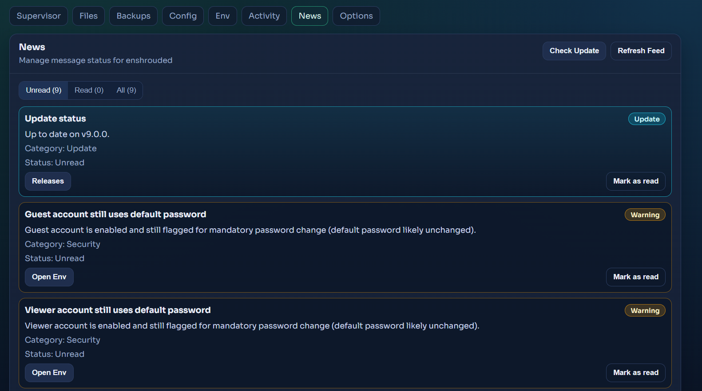
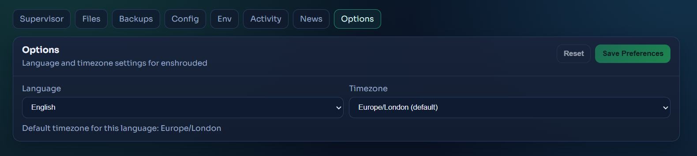

[](https://github.com/bonsaibauer)
[](https://github.com/bonsaibauer/supervisor-addon)
[](LICENSE)


[](https://github.com/bonsaibauer/supervisor-addon/issues/new)


# Supervisor Addon (`supervisor-addon`)

[](images/image_1.png)

## Screenshots

<details>
<summary>Show more screenshots</summary>

[](images/image_2.png)
[](images/image_3.png)
[](images/image_4.png)
[](images/image_5.png)
[](images/image_6.png)
[](images/image_7.png)
[](images/image_8.png)

</details>

This repository contains the full Supervisor addon stack:

- `supervisor_addon`: Supervisor XML-RPC namespace `addon.*`
- `supervisor_gateway`: FastAPI gateway (REST + SSE + auth + TLS + update)
- `panel`: React/Vite web UI

The gateway serves API and panel on the same port.

## Components and Architecture

### `supervisor_addon`

- Registers `[rpcinterface:addon]` in `supervisord`.
- Exposes server actions (start/stop/restart, backup, update).
- Reads action mapping and file paths from `SUPERVISOR_ADDON_*` env vars.
- Writes audit events to a JSONL log file (optional).

### `supervisor_gateway`

- FastAPI app with endpoints for:
  - Auth (`/auth/*`)
  - Server/power/backups/updates/news (`/api/*`)
  - Files (read/write/upload/download)
  - Logs including SSE streaming
  - Activity feed
- Uses Supervisor XML-RPC via Unix socket (`unix://...`).
- Auto-generates self-signed TLS certificates when enabled.
- Serves static panel files from `SUPERVISOR_GATEWAY_PANEL_DIR`.

### `panel`

- React 18 + React Router + Vite.
- Routes:
  - `/console`
  - `/files`
  - `/backups`
  - `/config`
  - `/env`
  - `/activity`
  - `/news`
- Role/permission-based navigation and page access.

## Current Feature Set

- Session login + API token auth
- Role/permission model from per-user JSON files
- Forced password change for bootstrap users (`must_change_password`)
- Security headers, HTTPS enforcement, optional proxy-header trust
- Per-IP API/login rate limits
- File access with root restrictions, writable allowlist, and TLS path blocking
- Live log streaming via SSE
- Runtime CPU from `/proc/stat` + RAM from `/proc/meminfo` (no Docker socket required)
- News system with update checks, TLS hints, and security hints
- Update installer with checksum verification, backup, rollback, optional restart

## Auth and Roles

Startup behavior:

- `admin` is always ensured.
- Default bootstrap password is `change-me`.
- Bootstrap users are initially forced to change password.

Persistent auth data:

- User files: `SUPERVISOR_GATEWAY_AUTH_USERS_DIR`
- Templates: `SUPERVISOR_GATEWAY_AUTH_TEMPLATES_DIR`

Templates:

- `admin` always enabled
- `guest` optional via `AUTH_TEMPLATE_GUEST_ENABLED=true`
- `viewer` optional via `AUTH_TEMPLATE_VIEWER_ENABLED=true`
- additional templates via `AUTH_TEMPLATE_<NAME>_ENABLED=true`

Token sources:

- Cookie `sgw_session`
- `Authorization: Bearer <token>`
- `X-API-Token: <token>`

## Security Defaults

Important defaults from `.env.example`:

- `SUPERVISOR_GATEWAY_REQUIRE_HTTPS=true`
- `SUPERVISOR_GATEWAY_INSECURE_HTTP_LOCAL_ONLY=true`
- `SUPERVISOR_GATEWAY_TRUST_PROXY_HEADERS=false`
- `SUPERVISOR_GATEWAY_TLS_AUTO_GENERATE=true`
- `SUPERVISOR_GATEWAY_CORS_ALLOW_CREDENTIALS=false`
- `SUPERVISOR_GATEWAY_API_RATE_LIMIT_PER_MINUTE=240`
- `SUPERVISOR_GATEWAY_LOGIN_RATE_LIMIT_PER_MINUTE=10`

Note:

If `SUPERVISOR_GATEWAY_API_TOKEN` or `SUPERVISOR_GATEWAY_AUTH_SECRET` is not set, random values are generated at startup (not persistent).

## API Overview

- `GET /health`
- `POST /auth/login`
- `GET /auth/me`
- `POST /auth/change-password`
- `POST /auth/logout`
- `GET /api/servers/{server_id}`
- `POST /api/servers/{server_id}/power`
- `POST /api/servers/{server_id}/backups`
- `POST /api/servers/{server_id}/updates`
- `GET /api/servers/{server_id}/stats`
- `GET /api/servers/{server_id}/files/*`
- `GET /api/servers/{server_id}/logs/{channel}/stream`
- `GET /api/servers/{server_id}/news`
- `POST /api/servers/{server_id}/news/{news_id}/read`
- `POST /api/servers/{server_id}/tls/renew`
- `GET /api/update/status`
- `POST /api/update/install`

## Repository Structure

```text
supervisor_addon/        # Supervisor XML-RPC addon
supervisor_gateway/      # FastAPI gateway + services
panel/                   # React panel
docs/                    # Security + env reference
.env.example             # Example env file
supervisord.addon.conf   # Supervisor rpcinterface + program
```

## Local Development

### Requirements

- Python >= 3.10
- Node.js >= 20 (recommended)
- Running Supervisor with Unix socket for real RPC tests

### Python/Gateway

```bash
python -m venv .venv
source .venv/bin/activate
pip install -e .
```

Set env vars (at least `SUPERVISOR_GATEWAY_RPC_URL`) and start:

```bash
supervisor-gateway
```

### Panel

```bash
cd panel
npm ci
npm run dev
```

Production build:

```bash
cd panel
npm run build
```

## Operations and Verification

Example runtime checks:

```bash
supervisorctl reread
supervisorctl update
supervisorctl status
curl -kfsS https://127.0.0.1:8080/health
```

Expected:

- `supervisor-gateway` is running
- `/health` returns HTTP 200 with status JSON
- Panel is reachable via the gateway port

## Update System

- Update check against GitHub Releases (`/api/update/status`)
- Install via API (`/api/update/install`)
- Expected asset: `SUPERVISOR_GATEWAY_UPDATE_ASSET_NAME` (+ optional `.sha256`)
- Wheel is installed from the payload
- Files are replaced with backup/restore logic
- Rollback runs on failure

Important:

Persistent state paths must **not** be inside `SUPERVISOR_GATEWAY_UPDATE_ROOT_DIR`, otherwise installation is intentionally blocked.

## Additional Docs

- Security: `docs/SECURITY_GUIDE.md`
- Env reference: `docs/ENV_EXAMPLE_REFERENCE.md`
- Translation rules: `docs/i18n/translation-guidelines.md`
- Example values: `.env.example`

## Project Links

- Repository: https://github.com/bonsaibauer/supervisor-addon
- Issues: https://github.com/bonsaibauer/supervisor-addon/issues/new/choose
